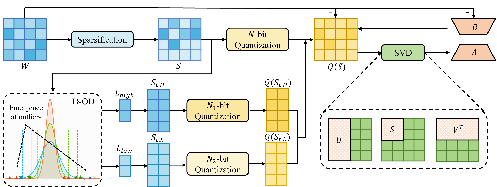

# $\text{Q-SA}^2$

Source code of "$\text{Q-SA}^2$: Enhanced Low-Bit Quantization-Aware Fine-Tuning via Structure-Aware Adaptation".



## Steps

### Apply $\text{Q-SA}^2$ and save

```
#!/bin/bash

SAVE_DIR="model_zoo/qsa2/"

CUDA_VISIBLE_DEVICES=0 python quantize_save.py \
    --model_name_or_path meta-llama/Llama-2-7b-hf \
    --bits 2 \
    --iter 5 \
    --rank 64 \
    --save_dir $SAVE_DIR
```

### Load and train

```
base_model = AutoModelForCausalLM.from_pretrained(
    model_args.model_name_or_path,
    low_cpu_mem_usage=True,
    torch_dtype=torch.bfloat16,
    token=model_args.token,
)

peft_model = PeftModel.from_pretrained(
    base_model,
    model_args.adapter_name_or_path,
    is_trainable=True if training_args.do_train else False,
    token=model_args.token,
)
```

### Fine-tunig

```
CUDA_VISIBLE_DEVICES=0 python train_clm.py \
--model_name_or_path./quantize_and_save/model_zoo/qsa2/Llama-2-7b-hf-2bit-64rank \
--adapter_name_or_path /quantize_and_save/model_zoo/qsa2/Llama-2-7b-hf-2bit-64rank/qsa2_init \
--output_dir exp_results/qsa2/wikitext-2/seed0nf2r64lr6e-5 \
--learning_rate 6e-5 \
--seed 0 \
--dataset_name wikitext-2-raw-v1 \
--num_train_epochs 2 \
--per_device_train_batch_size 8 \
--per_device_eval_batch_size 8 \
--gradient_accumulation_steps 2 \
--save_strategy "epoch" \
--warmup_ratio 0.03 \
--lr_scheduler_type "cosine" \
--logging_steps 1 \
--do_train --do_eval \
--logging_steps 50 \
--block_size 1024 \
--weight_decay 0.1
```

### Main Results


## Acknowledgments

Part of the code is borrowed from [LoftQ](https://github.com/yxli2123/LoftQ).